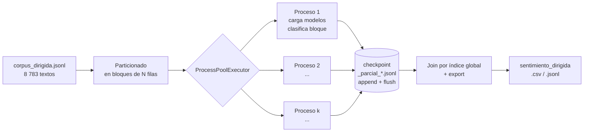
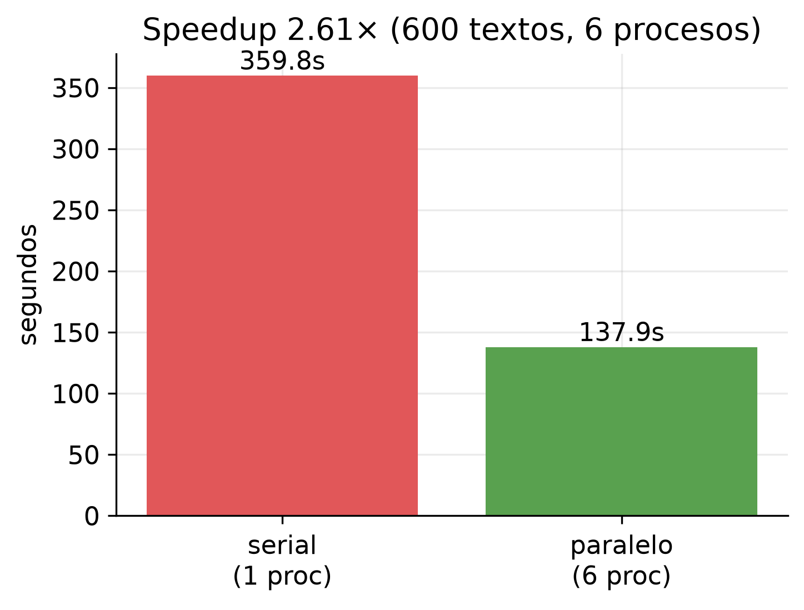
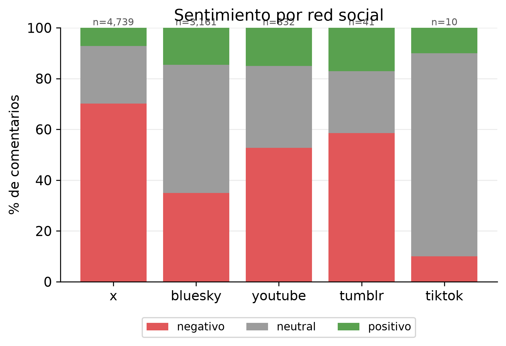
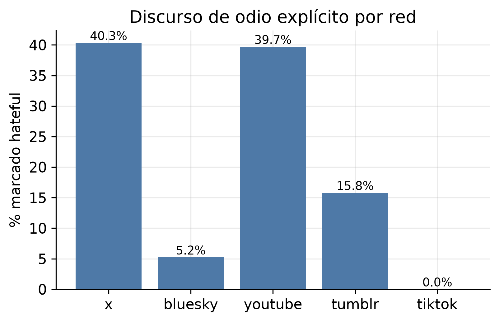
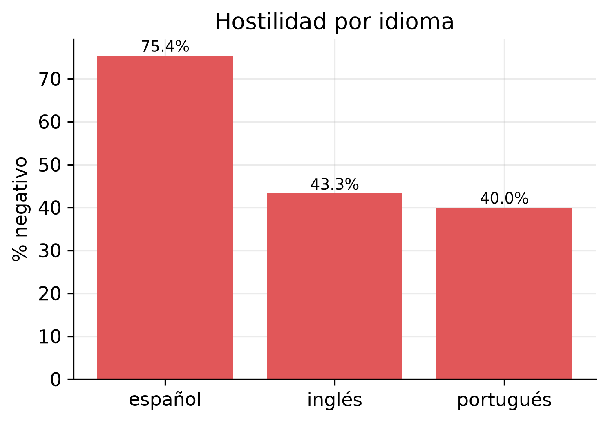
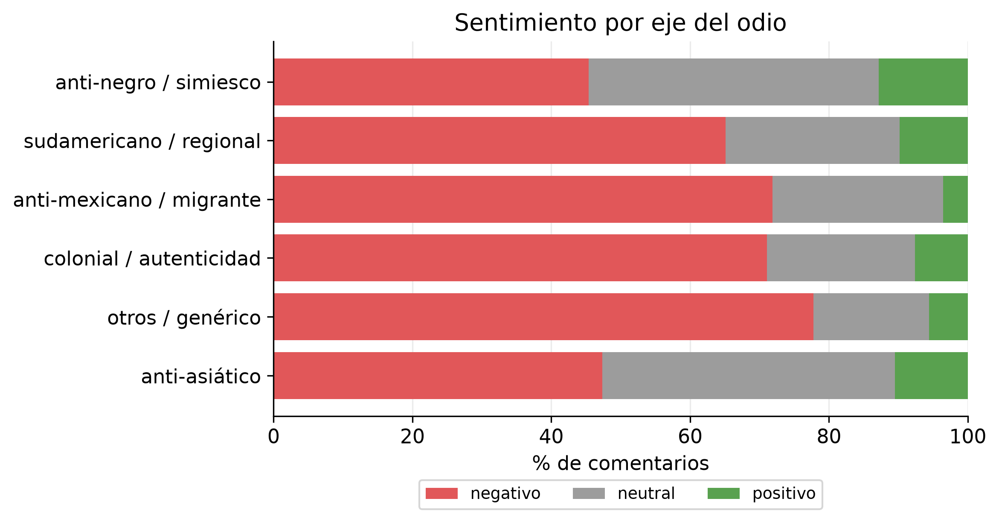
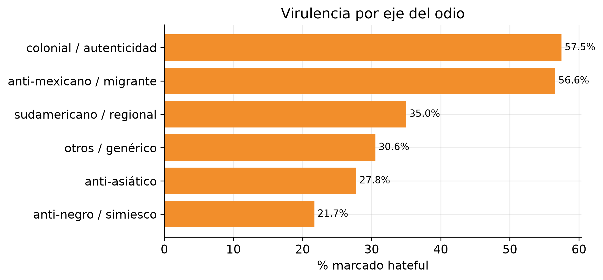

# Práctica de Laboratorio 07 — Análisis paralelo de sentimientos sobre datos de redes sociales

**Asignatura:** Computación Paralela · **Grupo:** C
**Problemática:** Xenofobia en redes sociales durante el Mundial FIFA 2026


## 1. Introducción y relación con la Práctica 6

Esta práctica es la segunda etapa de un trabajo encadenado sobre **análisis de sentimientos**. En la Práctica 6 se implementó un sistema de **extracción concurrente** (hilos + cola) que recolectó comentarios sobre el Mundial FIFA 2026 desde cinco fuentes digitales. Aquí se toma ese corpus y se implementa un **análisis de sentimientos paralelo** que clasifica cada texto en *positivo*, *negativo* o *neutral*, y —por la naturaleza de la problemática— marca además la presencia de **discurso de odio** (*hate speech*).

El objetivo no es solo etiquetar: es **cuantificar el tono y la agresividad** del discurso xenófobo por red social, por idioma y por eje temático del odio, generando la evidencia que alimentará la visualización, la comparación entre redes y el artículo académico del proyecto final.

**Continuidad metodológica.** La técnica de paralelismo se eligió *en contraste deliberado* con la Práctica 6:

- **Práctica 6 (extracción):** trabajo **I/O-bound** (esperar respuestas de red). El GIL se
  libera durante la espera, por lo que **hilos + `queue.Queue`** dan paralelismo real de
  espera.
- **Práctica 7 (inferencia):** trabajo **CPU-bound** (cómputo puro del transformer). El GIL
  serializa hilos en CPU, así que el paralelismo real lo dan **procesos**
  (`ProcessPoolExecutor`).

Mismo hilo conductor, técnica adaptada a la naturaleza de cada tarea. Este contraste es en sí mismo un resultado de la asignatura.

---

## 2. Uso del dataset generado en la Práctica 6

El análisis parte del corpus **curado** de la Práctica 6 (notebook `curacion_datos.ipynb`, que perfila cada fuente, normaliza el texto, deduplica y re-marca el léxico xenófobo). El corpus se entrega en **dos capas**, conservando la trazabilidad exigida (cada registro identifica su **red de origen**, su **criterio de búsqueda** y su **contenido textual**):

| Capa | Registros | Descripción |
|---|---|---|
| `corpus_completo` | **396 841** | Todo lo recolectado (YouTube 357 064, Bluesky 26 122, Tumblr 7 651, X 4 846, TikTok 1 158). |
| `corpus_dirigida` | **8 783** | Núcleo denso: comentarios que matchean el léxico xenófobo curado. **Auditable a mano.** |

El análisis de sentimientos de este informe se ejecuta sobre **`corpus_dirigida` (8 783 registros)** por dos razones: (a) es donde se concentra la señal de la problemática (la xenofobia es un fenómeno de *aguja en el pajar*), y (b) su tamaño permite revisión humana y control de calidad. El pipeline es idéntico para `corpus_completo` (basta cambiar un parámetro), pero clasificar las ~397 k no aporta señal proporcional al costo.

**Composición del núcleo dirigido por red:**

| Red | Registros | % del corpus dirigido |
|---|---|---|
| X (Twitter) | 4 739 | 54.0 % |
| Bluesky | 3 161 | 36.0 % |
| YouTube | 832 | 9.5 % |
| Tumblr | 41 | 0.5 % |
| TikTok | 10 | 0.1 % |

Se cumple el requisito de **al menos tres redes** con datos reales (aquí cinco).

---

## 3. Propuesta y justificación del modelo

**Modelo elegido: `pysentimiento`** — una librería de modelos *transformer* preentrenados,
ejecutados **localmente**.

**Justificación:**

1. **Dominio adecuado.** Está entrenado sobre *tweets*, es decir texto corto, informal y con jerga — exactamente la naturaleza de los comentarios recolectados.
2. **Multiidioma.** Cubre **español, inglés, portugués e italiano**, imprescindible para un corpus donde conviven esos idiomas (§7). Cada texto se rutea al modelo de su idioma declarado (o a español por defecto).
3. **Detección de odio integrada.** Además del sentimiento (POS/NEG/NEU) ofrece un modelo de *hate speech*, que **encaja directamente con la problemática de xenofobia** y permite un segundo eje de análisis sin montar otro sistema.
4. **Local y reproducible.** No depende de una API de pago ni de conexión constante; una vez descargados los pesos, corre offline. Esto lo hace **auditable** y **repetible** por el evaluador.
5. **Costo/beneficio frente a un LLM.** Un LLM (p. ej. Claude) daría matices, pero a costo por token y con dependencia de red para 8 783+ textos. Se dejó implementado como **fallback de validación** (celda opcional que mide el acuerdo LLM vs. modelo local sobre una muestra), pero el motor principal es el modelo local por eficiencia y reproducibilidad.

**Categorías de salida:** `positivo`, `negativo`, `neutral` (las que pide la rúbrica), más un
marcado binario `odio` (hateful / no) con su score.

---

## 4. Diseño de la solución paralela

El procesamiento se diseñó como un **pool de procesos** que clasifican **bloques** del corpus en paralelo, con **persistencia incremental** para robustez.


**Figura 2.** Arquitectura de la solución paralela por procesos.

**Decisiones de diseño:**

- **Procesos, no hilos** (§1): la inferencia es CPU-bound; el GIL impediría paralelismo real con hilos. Se usa `concurrent.futures.ProcessPoolExecutor`.
- **Particionado en bloques.** El corpus se divide en bloques de tamaño fijo; cada bloque es una unidad de trabajo que se envía a un proceso. Así se **divide el corpus** y se **procesan lotes en paralelo** (dos de las estrategias que la rúbrica lista explícitamente).
- **El worker es un módulo aparte** (`sentimiento_worker.py`, no una función del notebook) para que el pool pueda serializarlo (*pickle*) tanto con `fork` como con `spawn`. Cada proceso **carga los modelos una sola vez** y clasifica su bloque en lote.
- **Checkpoint incremental + reanudación.** Cada bloque terminado se escribe al vuelo (`append` + `flush`) a un archivo parcial. Si el proceso se corta, **no se pierde lo ya hecho**; al re-ejecutar, se saltan los índices ya clasificados. Es el mismo patrón de robustez de la Práctica 6 (guardado incremental + dedup).
- **Aislamiento de fallos.** Un bloque que lanza excepción se registra y se omite; el resto del pool continúa (`as_completed` + `try/except`).

---

## 5. Implementación funcional

**Archivos:**

| Archivo | Rol |
|---|---|
| `analisis_sentimiento.ipynb` | Notebook orquestador: carga, clasificación paralela, benchmark, export y visualización. |
| `sentimiento_worker.py` | Unidad de trabajo por proceso (importable): carga los modelos y clasifica un bloque. |
| `pyproject.toml` / `uv.lock` | Entorno **propio** de la P7 (Python 3.11–3.13 + torch/pysentimiento). |
| `ENTORNO.md` | Receta de instalación reproducible. |

**Detalle de implementación que resultó crítico — *thread pinning*.** En una primera versión el paralelo iba **más lento que el serial** (speedup ≈ 0.97×). La causa fue **sobre-suscripción de hilos**: `torch` ya es internamente multihilo, de modo que *N* procesos × *N* hilos cada uno saturaban la CPU compitiendo entre sí. La solución fue **fijar cada proceso a un solo núcleo** (`torch.set_num_threads(1)` + variables de entorno `OMP/MKL/OPENBLAS/NUMEXPR_NUM_THREADS=1`): así el paralelismo lo dan **exclusivamente los procesos**, con una unidad de cómputo limpia por núcleo. Este ajuste llevó el speedup de 0.97× a un rango de 2–3× (§6) y es un hallazgo transferible sobre paralelismo con librerías que ya paralelizan internamente.

**Gestión de memoria.** Cada proceso carga ~3.5–4 GB de modelos (sentimiento + odio). Con 20 procesos (todos los núcleos) se pedirían ~70 GB de RAM → *swapping* y degradación. Se limita el número de procesos a un valor que **entra en la RAM disponible** (6 procesos ≈ 23 GB). Es una decisión consciente: en inferencia con modelos pesados, el paralelismo útil está acotado por memoria, no por número de núcleos.

**Ejecución verificada.** El pipeline clasificó los **8 783** textos del corpus dirigido de principio a fin, con checkpoint completo y exportación correcta (§7).

---

## 6. Técnica de paralelismo y evidencia de speedup

Para cuantificar la aceleración se clasificó una **muestra fija de 600 textos**, primero con
**1 proceso** (serial) y luego con **6 procesos** (paralelo), partiendo la muestra en una
porción por proceso (*strong scaling*).

| Configuración | Procesos | Tiempo |
|---|---|---|
| Serial | 1 | **359.8 s** |
| Paralelo | 6 | **137.9 s** |
| **Speedup** | | **2.61×** |
| **Eficiencia** | | **43 %** (sobre 6 procesos) |


**Figura 1.** Tiempo de clasificación de 600 textos: serial (1 proceso) vs. paralelo (6 procesos).

**Interpretación (importante para el análisis).** La eficiencia sub-lineal (43 %) es **esperable y explicable**, no un defecto: cada uno de los 6 procesos paga un **costo fijo de carga de modelos** (~4 GB) que el serial paga una sola vez. En una muestra pequeña (100 textos/proceso) esa carga pesa mucho respecto al trabajo útil, lo que limita la eficiencia (ley de Amdahl: la fracción serial —la carga— acota el speedup). En la **corrida completa** (8 783 textos) ese costo se **amortiza** sobre mucho más trabajo por proceso, de modo que el beneficio efectivo del job real es **mayor** que el de este micro-benchmark. La evidencia confirma que el paralelismo por procesos **acelera de forma real** la clasificación.

---

## 7. Almacenamiento estructurado de los resultados

La salida se guarda en **`data/sentimiento_dirigida.csv`** y **`.jsonl`** (8 783 filas). Cada
registro **relaciona el texto original con su clasificación de sentimiento y con su red de
origen**, cumpliendo el requisito de trazabilidad y sirviendo de insumo directo al proyecto
final. Esquema de columnas:

| Columna | Significado |
|---|---|
| `id`, `red`, `criterio_busqueda` | Trazabilidad heredada de la P6 (fuente y consulta). |
| `texto`, `idioma` | Contenido y su idioma. |
| `estrategia`, `es_dirigida`, `matchea_lexico`, `ejes` | Marcado xenófobo previo (capa y ejes del odio). |
| **`sentimiento`, `sent_score`** | Clasificación POS/NEG/NEU y su confianza. |
| **`odio`, `odio_score`** | Marcado de *hate speech* y su confianza. |

---

## 8. Resultados y análisis

**Distribución global** (8 783 textos del núcleo dirigido): **negativo 55.7 %** (4 892) · neutral 33.7 % (2 960) · positivo 10.6 % (931). El predominio negativo es coherente y esperado: el corpus dirigido es la *aguja* de odio, no una muestra representativa de toda la conversación del Mundial. **Estos resultados miden el tono dentro de lo ya marcado como potencialmente xenófobo.**

### 8.1 X es el epicentro del odio

| Red | n | Negativo | Neutral | Positivo | Hateful |
|---|---|---|---|---|---|
| **X** | 4 739 | **70.1 %** | 22.7 % | 7.2 % | **40.3 %** |
| YouTube | 832 | 52.8 % | 32.2 % | 15.0 % | 39.7 % |
| Tumblr | 41 | 58.5 % | 24.4 % | 17.1 % | 15.8 % |
| Bluesky | 3 161 | 35.0 % | 50.5 % | 14.5 % | 5.2 % |
| TikTok | 10 | 10.0 % | 80.0 % | 10.0 % | 0.0 % |


**Figura 3.** Distribución de sentimiento por red social.


**Figura 5.** Porcentaje de comentarios marcados como discurso de odio explícito, por red.

X concentra la agresión directa (70 % negativo, 40 % hateful), con insultos explícitos. Esto refuerza el gancho **"X como amplificador"** de la problemática: es la red con la señal más densa y hostil.

### 8.2 La anomalía de Bluesky: contra-discurso, no odio

Bluesky aparece con solo **5.2 % hateful** pese a ser captura dirigida. La inspección manual muestra que su contenido es mayormente **contra-discurso y denuncia** (en inglés y portugués): comentarios que *mencionan* los términos del léxico pero **para condenar el racismo** (p. ej. *"Argentinian woman arrested in Brazil after calling some folks monkey (racism)"*). El modelo los marca correctamente como no-hateful. Bluesky captura la **meta-conversación**; X y YouTube capturan la agresión. Es un contraste de culturas de plataforma valioso para el artículo del proyecto final.

### 8.3 El idioma es el mejor predictor de hostilidad

| Idioma | n | % Negativo |
|---|---|---|
| Español | 3 654 | **75.4 %** |
| Inglés | 3 947 | 43.3 % |
| Portugués | 940 | 40.0 % |


**Figura 7.** Hostilidad (% negativo) por idioma.

El contenido en **español es marcadamente más hostil** que en inglés o portugués: la xenofobia de este corpus es predominantemente hispanohablante (rivalidad futbolística latinoamericana). El sesgo al inglés de Bluesky explica, desde otro ángulo, su suavidad aparente (§8.2).

### 8.4 Los ejes más virulentos no son el más voluminoso

| Eje del odio | n | % Hateful |
|---|---|---|
| Colonial / autenticidad | 211 | **57.5 %** |
| Anti-mexicano / migrante | 893 | **56.6 %** |
| Sudamericano / regional | 1 605 | 35.0 % |
| Otros / genérico | 36 | 30.6 % |
| Anti-asiático | 19 | 27.8 % |
| Anti-negro / simiesco | 4 765 | 21.7 % |


**Figura 4.** Distribución de sentimiento por eje del odio.


**Figura 6.** Virulencia (% hateful) por eje del odio.

El eje **anti-negro/simiesco** es el más **voluminoso** (4 765) pero el de menor proporción de odio explícito (21.7 %), mientras que **colonial** y **anti-mexicano** son los más **virulentos** en proporción. Esto conecta con la limitación central del modelo (§9).

### 8.5 Hallazgo central: el modelo subdetecta el odio implícito

El 29.9 % global de *hateful* es un **piso, no un techo**. La inspección de los casos anti-negro marcados "no hateful" revela odio **codificado** que el transformer no captura:

- **Leetspeak:** `m0n0`, `macac0s`.
- **Emoji:** 🍌🍌🍌, 🐒, *"uga uga uga"*.
- **Portmanteaus:** *"mexisimios"*, *"Ecuakong"*, *"Mechico"*.
- **Ironía / humor:** *"se merecen la extinción"* (marcado negativo, no hateful).

Esto **no es un fallo a ocultar: es un resultado**. Confirma la hipótesis rectora del proyecto —**el odio como humor y hate speech implícito escapa a los clasificadores estándar**— y justifica el enfoque complementario de **léxico curado + revisión humana** sobre el núcleo dirigido. Es material central para el artículo académico.

---

## 9. Limitaciones

1. **Subdetección de odio implícito** (§8.5): el modelo pierde el odio codificado (leet, emoji, portmanteaus, ironía). El marcado de *hate speech* debe leerse como cota inferior.
2. **Sesgo de selección:** el análisis se hace sobre el núcleo *dirigido* (la aguja), no sobre la conversación general; los porcentajes describen el tono **dentro** de lo ya marcado como xenófobo.
3. **Idioma declarado imperfecto:** algunos textos muy cortos se rutean a español por defecto; una minoría de idiomas (`ja`, `fr`, `it`) tiene soporte parcial.
4. **Eficiencia acotada por memoria/carga de modelos** (§6): el paralelismo útil está limitado por la RAM (carga de ~4 GB por proceso), no por el número de núcleos.

---

## 10. Relación con el proyecto final

Este análisis produce el insumo directo de la tercera etapa:

- **Visualización / dashboard:** las Figuras 3–7 (sentimiento y odio por red, idioma y eje)
  son la base de las estadísticas comparativas.
- **Storytelling:** los tres hallazgos (X como epicentro, español como idioma más hostil,
  subdetección del odio implícito) estructuran la narrativa.
- **Artículo académico:** el contraste hilos (P6, I/O-bound) vs. procesos (P7, CPU-bound), el
  ajuste de *thread pinning* y la limitación del odio implícito son secciones metodológicas
  listas para redactar.

---

## 11. Conclusiones

Se implementó un análisis de sentimientos **funcional y paralelo por procesos** sobre el corpus xenófobo de la Práctica 6, clasificando 8 783 comentarios en positivo/negativo/neutral y marcando discurso de odio, con **speedup medido de 2.61×** y almacenamiento estructurado y trazable. Más allá del cumplimiento técnico, los resultados aportan hallazgos sustantivos —X como epicentro, hostilidad concentrada en español, y la subdetección del odio implícito— que alimentan directamente el proyecto final y validan la hipótesis rectora del trabajo.

---

## Anexo A — Reproducibilidad

```bash
# Desde practica_07/ (entorno propio, Python 3.11–3.13)
uv python install 3.12
uv sync --python 3.12          # descarga torch + pysentimiento (~2–3 GB la 1ª vez)
uv run jupyter nbconvert --to notebook --execute --inplace analisis_sentimiento.ipynb
```

Config editable en la primera celda: `CORPUS` (`dirigida`|`completo`), `N_WORKERS`,
`ANALIZAR_ODIO`, `TAMANO_BLOQUE`. Salida en `data/sentimiento_<capa>.csv/.jsonl`.

## Anexo B — Cobertura de la rúbrica

| Criterio | Pts | Sección |
|---|---|---|
| Uso correcto del dataset de la P06 | 0.5 | §2 |
| Propuesta y justificación del modelo | 0.8 | §3 |
| Diseño de la solución paralela | 0.7 | §4 |
| Implementación funcional | 1.0 | §5, §8 |
| Uso adecuado de técnicas de paralelismo | 0.8 | §1, §4, §6 |
| Almacenamiento estructurado | 0.5 | §7 |
| Evidencia de ejecución y resultados | 0.4 | §6, §8 |
| Informe técnico y relación con el proyecto final | 0.3 | §10, todo el documento |
| **Total** | **5.0** | |
