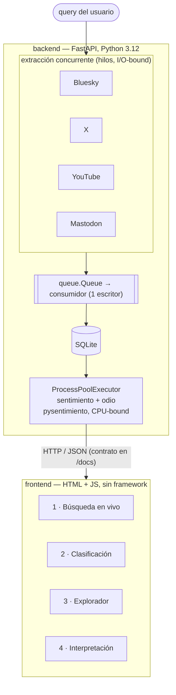

# Proyecto final — Plataforma de análisis de xenofobia en el Mundial 2026

Aplicación web que recibe una consulta del usuario, extrae comentarios de forma **concurrente** desde cuatro redes sociales, clasifica su sentimiento y su carga de odio con un modelo local paralelizado, y presenta los resultados con exploración y storytelling.

Es la tercera etapa del proyecto: reúne la extracción paralela de la Práctica 6 y el análisis de sentimientos de la Práctica 7 en un solo flujo interactivo, y se documenta formalmente en un artículo académico (`../paper/`).

## Qué hace, de punta a punta



Las cuatro redes se lanzan a la vez, cada una en su hilo (extracción es I/O-bound: esperar red). Un único consumidor consolida y escribe en SQLite. Luego un pool de procesos clasifica (inferencia es CPU-bound). El frontend consume la API por HTTP y refleja las dos fases en vivo.

## Cómo cubre la rúbrica de la aplicación (8 pts)

| Criterio | Dónde |
|---|---|
| Extracción concurrente por query desde ≥4 redes | 4 extractores en hilos (Bluesky, X, YouTube, Mastodon); pestaña 1 muestra el paralelismo en vivo |
| Clasificación de sentimientos global y por red | pool de procesos + pestaña 2 (sentimiento global, por red y odio por red) |
| Visualización y exploración | pestaña 3: cada comentario con red, idioma, sentimiento y odio, filtrable |
| Storytelling y explicabilidad | pestaña 4: lectura cualitativa de la búsqueda + los cinco hallazgos del corpus P7 |

La evidencia de que las redes corren de verdad en paralelo es que el tiempo de pared es el **máximo** por red, no la **suma** (medido: 9.27 s de pared frente a 13.15 s de suma, las cuatro redes a la vez). El detalle está en `backend/README.md`.

## Las dos técnicas de paralelismo, en un solo sistema

El eje del proyecto se conserva aquí: **hilos** para extraer (I/O-bound, el GIL se libera esperando red) y **procesos** para clasificar (CPU-bound, donde el GIL serializaría). No es una elección estética; cada etapa tiene un cuello distinto. La justificación completa, junto con el porqué de Python 3.12, SQLite y el pool caliente, vive en `backend/README.md` y es la fuente de la sección de Metodología del artículo.

## Las cuatro redes en vivo

| Red | Acceso | Nota |
|---|---|---|
| Bluesky | API del protocolo abierto AT | búsqueda por texto libre; la más rápida |
| X | navegador Playwright con sesión manual | búsqueda por texto libre; ritual de sesión en `backend/README.md` |
| YouTube | Data API v3 (no el scraper de P6) | `search.list` + `commentThreads.list`, sin throttle por IP |
| Mastodon | timelines públicos por hashtag | fediverso, sin credenciales; sustituye a Reddit |

Reddit se descartó (en 2026 cerró el registro self-service de su Data API). Tumblr y TikTok solo aportan su corpus histórico, no se extraen en vivo. Cada red se adapta al modelo de acceso que impone su plataforma.

## Cómo se ejecuta

Dos procesos: el backend sirve la API, el frontend son archivos estáticos que la consumen.

```bash
# 1. Backend (API + modelos). Desde proyecto_final/backend/
uv sync                                       # 1a vez baja ~2 GB (torch + pesos HF)
cp .env.example .env                          # credenciales: Bluesky, YOUTUBE_API_KEY
uv run uvicorn plataforma.main:app --reload   # queda en http://127.0.0.1:8000, contrato en /docs

# 2. Frontend. Desde proyecto_final/frontend/
python3 -m http.server 5173                   # abrir http://127.0.0.1:5173
```

X necesita una sesión de navegador capturada a mano (dura semanas); el procedimiento está en `backend/README.md`. Para desarrollar la interfaz sin levantar el backend real hay un servidor de prueba (`frontend/mock/servidor_mock.py`), que no forma parte del sistema entregable.

La aplicación corre en local a propósito: el pool de modelos ocupa varios GB de RAM y X depende de una sesión de navegador real, dos cosas que no caben en un hosting gratuito. La rúbrica pide una aplicación *web* (interfaz en el navegador), no publicada en internet; el razonamiento completo está en `frontend/README.md`.

## Estructura

```text
proyecto_final/
├── backend/     API FastAPI + extracción concurrente + pool de sentimiento (Python 3.12)
│   └── README.md   arquitectura y decisiones técnicas (fuente de la Metodología del artículo)
└── frontend/    interfaz web (HTML + JS plano, Chart.js vendorizado)
    └── README.md   las cuatro pantallas, la paleta accesible y las decisiones de UI
```

El artículo académico que documenta la plataforma está en `../paper/`.
